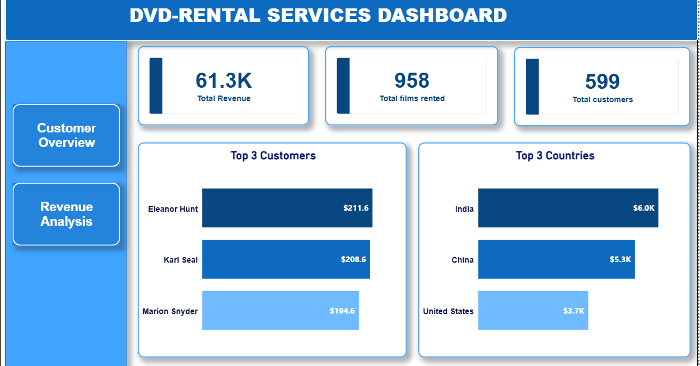
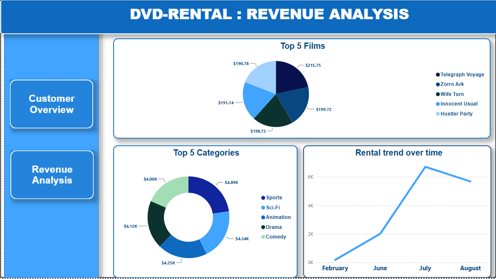

# DVD Rental Services Analysis

An end-to-end data analysis project using PostgreSQL, Python, and Power BI to transform raw DVD Rental data into actionable business insights.

## Key Insights
- India, China, and the United States generated the highest revenue.
- Sports, Sci-Fi, and Animation were the top revenue-generating film categories.
- Telegraph Voyage, Zorro Ark, and Wife Turn were the most rented films.
- Average Customer Lifetime Value (CLV): **$102**.
- Top customers by rental frequency: Eleanor Hunt, Karl Sean, and Marcia Dean.

## Dashboard
The interactive Power BI dashboard includes:
- Revenue & Customer KPIs
- Revenue Trend
- Top Categories
- Most Rented Films
- Customer Analysis

## Skills Demonstrated

- PostgreSQL
- Data Cleaning & Transformation
- Exploratory Data Analysis (EDA)
- Python (Pandas, Matplotlib)
- Data Visualization
- Power BI Dashboard Development
- Business Intelligence (BI)
- Business Insights & Reporting

- Python (Pandas, Matplotlib)
- Power BI
- Microsoft Word
